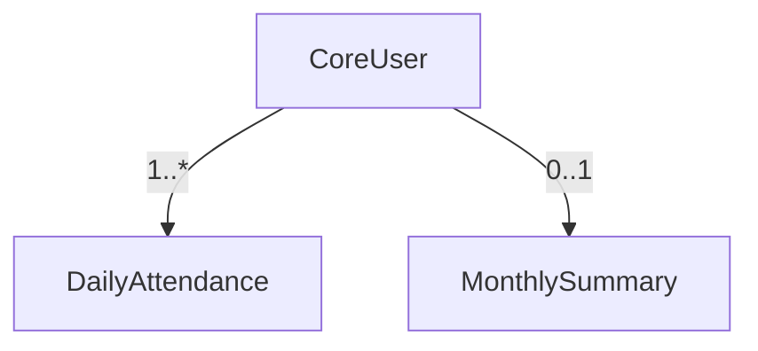

[用户表: CoreUser]
  id (PK)
  username (唯一)
  department (部门)
  role (角色)
  created_at (创建时间)
  last_login (最近登录)

[考勤记录: DailyAttendance]
  id (PK)
  user_id (FK -> CoreUser.id)
  punch_time (打卡时间)
  location (打卡地点)
  status (状态: 正常/异常)
```

## 关系说明
1. 一对多关系：一个用户可有多条考勤记录
2. 索引字段：CoreUser.username（唯一索引）、DailyAttendance.user_id（外键索引）

## 可视化建议
推荐使用以下工具生成图形：
1. [Mermaid Live Editor](https://mermaid.live/)
2. PlantUML IDE插件
3. draw.io 在线工具

Mermaid示例代码：
